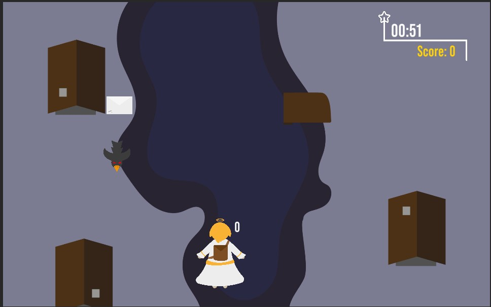
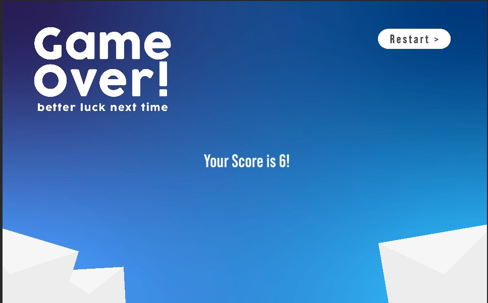

# Weihnachtsspiel-ChristlsMission-pkikl

### Project description: 
The Christkind has to collect the letters of all children in order to safe christmas.

### Development platform: 
Windows 10, Unity 2020.1.5f1, Visual Studio 2019

### Target platform: 
WebGL ref,res 960px x 600px, Screen Independent

### MVP:
- Christkind kann nach links & rechts fliegen
- Es muss Briefe einsammeln und den Vögeln ausweichen
- Zufällig erscheinen Kisten, wo es die Briefe lagern kann und somit den Score erhöhen kann
- Die Zeit rinnt nach unten

https://user-images.githubusercontent.com/72299690/114377478-fe577700-9b86-11eb-920a-9846a342be10.mp4

### Visuals: 

### Necessary setup/execution steps: 
After cloning, executing in Unity

### Third party material: 
Graphics by Peter Kikl

### Project state: 
80%

### Limitations: 

### Lessons Learned: 
1. Using static variables
2. display string variable on TMPro Text
3. Making a Countdown
4. Making a Score-Count
5. Adding a random spawnrate on GameObjects
6. Adding movement to a GameObject

Copyright by Peter Kikl
